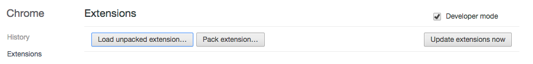
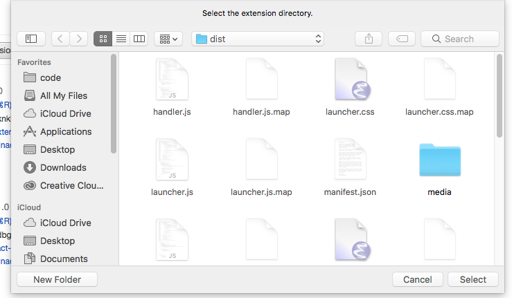
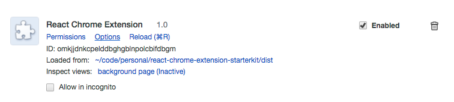
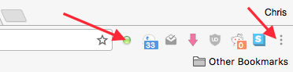
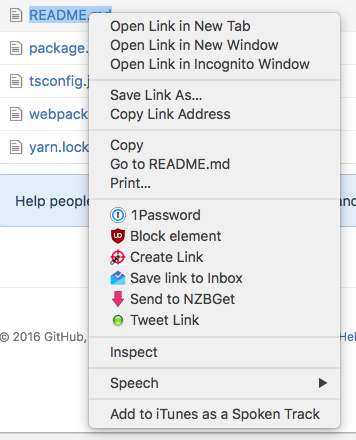

# React Chrome Extension Starter Pack

This project demonstrates one approach to writing Chrome extensions using React via TypeScript.

Its only functionality is tweeting a link to the current tab or any link in a webpage.

## Usage
```
git clone git@github.com:trbngr/react-chrome-extension-starterkit.git
cd react-chrome-extension-starterkit
yarn #or npm install
npm run build
```

In Chrome, open a new tab to `chrome://extensions`, check the `Developer mode` box and then click the `Load unpacked extension` button.



In the dialog that appears, select the directory that you cloned this repository to + `/dist`.



You should now see the `React Chrome Extension` extension listed.



And its icon. If you don't see it, it's buried in the menu to the right.



And on any webpage, right-click any link to expose the context menu.



## project structure
```
├── dist - compiled, distributable files.
├── public - static files
├── src
│   ├── Storage.ts - storage abstractions
│   ├── background - background scripts
│   ├── bootstrap - bootstrap css and fonts
│   ├── content_scripts - duh
│   └── ui - all the UI pages
│       ├── browser_action
│       ├── options
│       └── tweetLink
├── webpack - webpack config files
```

## Data-flow
```
 +----------------+                         +--------------------------------------+
 | browser_action +-------sendTweet--------->  background script                   |
 |                |                         |  'handler.ts'                        |
 |                |                         |                                      |
 |                +------copyToClipboard---->                                      |
 |                |                         |                                      |
 +----------------+                         |                                      |
                                            |                                      |
                                            +---------+------------------+---------+
                                                      ^                  ^
                                                      |                  |
 +---------------------------+                        |                  |
 | background script         |                        |                  |
 | 'menu.ts'                 |                     sendTweet      copyToClipboard
 |                           |                        +                  +
 |  Installs context menu    |                        |                  |
 +------------+--------------+                        |                  |
              |                                       |                  |
          onClick                                     |                  |
              |                                       |                  |
+-------------v----------------+                      |                  |
|content_script                |                      |                  |
|'launcher.ts'                 |                      |                  |
|                              |                      |                  |
|Registers message handlers to |                 +----+------------------+-----+
|inject iframes into webpages. |                 | tweet-link.html             |
|                              |                 |                             |
|                              +-----inject------>                             |
|                              |                 |                             |
|                              |                 |                             |
+------------------------------+                 +-----------------------------+

```

(Diagram made with [AsciiFlow](http://asciiflow.com))